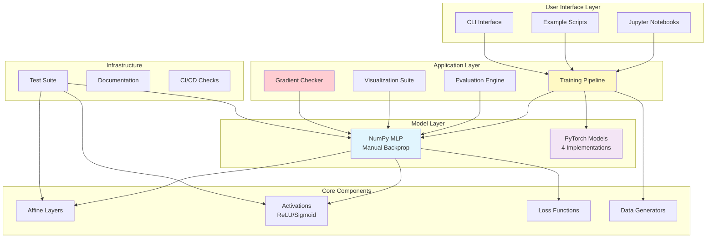
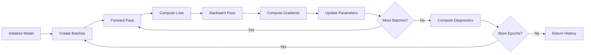
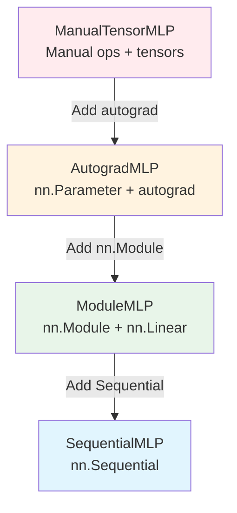
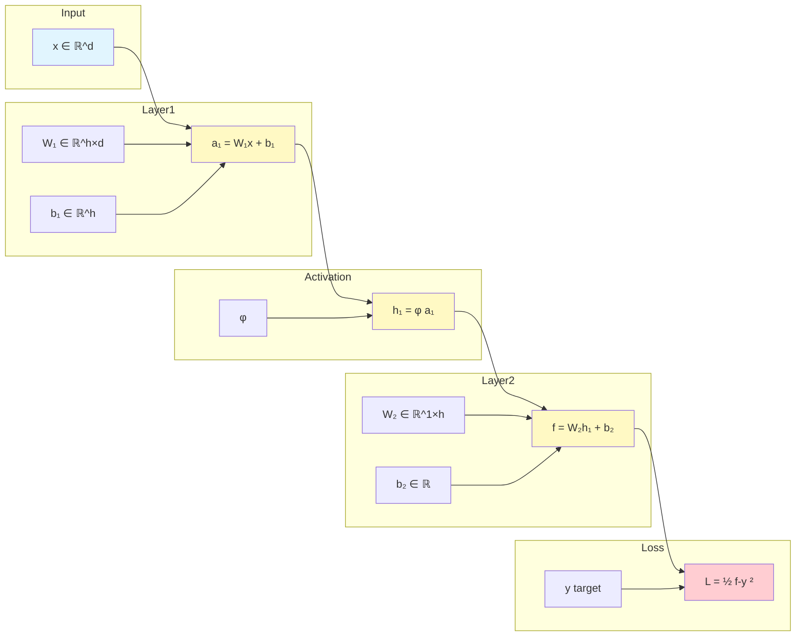
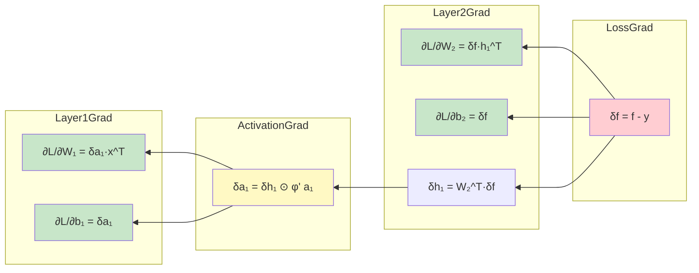
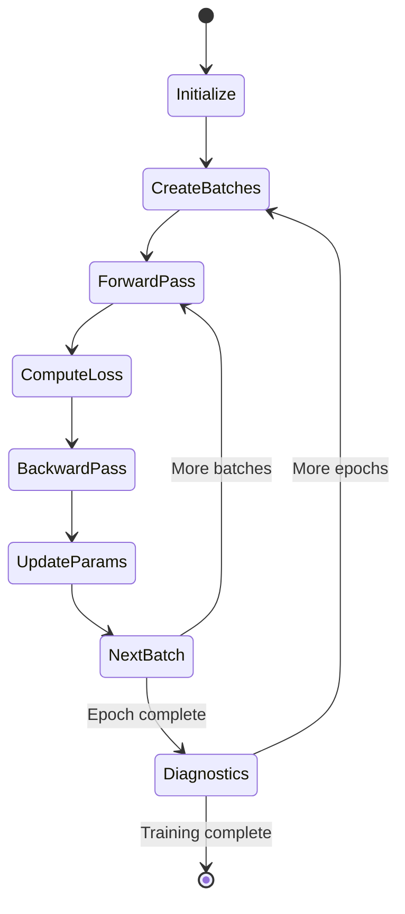

# Neural Network Architecture Documentation

**Version**: 1.0
**Last Updated**: 2025-11-15
**Project**: Pedagogical Neural Network Implementation

---

## Table of Contents

1. [Executive Summary](#executive-summary)
2. [System Architecture](#system-architecture)
3. [Component Breakdown](#component-breakdown)
4. [Data Flow and Computation Graphs](#data-flow-and-computation-graphs)
5. [API Reference](#api-reference)
6. [Design Patterns](#design-patterns)
7. [Mathematical Foundation](#mathematical-foundation)
8. [Testing Architecture](#testing-architecture)

---

## Executive Summary

### Project Overview

This project implements a **one-hidden-layer Multi-Layer Perceptron (MLP)** from mathematical first principles, progressing from manual NumPy implementation to production-ready PyTorch code. It serves as an educational resource demonstrating:

- **Mathematical rigor**: Every operation derived from theory
- **Implementation clarity**: Clean, well-documented code
- **Progressive abstraction**: From manual backprop to high-level APIs
- **Correctness verification**: Numerical gradient checking

### Technology Stack

| Layer | Technology | Purpose |
|-------|-----------|---------|
| Core ML | NumPy | Manual implementation with explicit backpropagation |
| Framework | PyTorch | Progressive implementations (4 abstraction levels) |
| Visualization | Matplotlib | Training curves, decision boundaries, diagnostics |
| Testing | pytest | Unit tests, gradient checks, equivalence tests |
| Notebooks | Jupyter | Interactive tutorial and demonstrations |

### Key Metrics

- **Total Lines of Code**: ~2,500
- **Test Coverage**: Comprehensive (all critical paths)
- **Modules**: 9 core modules
- **Documentation**: Extensive docstrings (NumPy style)
- **Gradient Check Accuracy**: < 1e-7 relative error

---

## System Architecture

### High-Level Architecture Diagram



### Layered Architecture

```
┌─────────────────────────────────────────────────────────────┐
│                    PRESENTATION LAYER                        │
│  • Jupyter Notebooks  • CLI Scripts  • Examples             │
└─────────────────────────────────────────────────────────────┘
                              ↓
┌─────────────────────────────────────────────────────────────┐
│                    APPLICATION LAYER                         │
│  • Training Loop  • Evaluation  • Visualization             │
│  • Diagnostics  • Gradient Verification                     │
└─────────────────────────────────────────────────────────────┘
                              ↓
┌─────────────────────────────────────────────────────────────┐
│                      MODEL LAYER                             │
│  • OneHiddenLayerMLP (NumPy)                                │
│  • PyTorch Implementations (Manual/Autograd/Module/Seq)     │
└─────────────────────────────────────────────────────────────┘
                              ↓
┌─────────────────────────────────────────────────────────────┐
│                    COMPONENT LAYER                           │
│  • AffineLayer  • Activations  • Loss  • Optimizers         │
└─────────────────────────────────────────────────────────────┘
                              ↓
┌─────────────────────────────────────────────────────────────┐
│                  FOUNDATION LAYER                            │
│  • NumPy  • PyTorch  • Data Structures                      │
└─────────────────────────────────────────────────────────────┘
```

---

## Component Breakdown

### 1. Core Components (`src/`)

#### 1.1 Layers Module (`layers.py`)

**Responsibility**: Affine (linear) transformations

**Class**: `AffineLayer`

```python
class AffineLayer:
    """
    Implements: z = Wx + b

    Parameters:
        W ∈ ℝ^(output_dim × input_dim)  # Weight matrix
        b ∈ ℝ^(output_dim)               # Bias vector
    """
```

**Key Methods**:

| Method | Input | Output | Purpose |
|--------|-------|--------|---------|
| `forward(x)` | (d,) or (n,d) | (m,) or (n,m) | Compute z = Wx + b |
| `backward(dL_dz)` | gradient | (dL_dx, dL_dW, dL_db) | Backpropagation |
| `initialize_parameters()` | - | - | Random init (Gaussian 0.1σ) |

**Mathematical Details**:

Forward pass:
- Single: `z = W @ x + b`
- Batch: `Z = X @ W.T + b`

Backward pass:
- ∂L/∂x = W^T · ∂L/∂z
- ∂L/∂W = ∂L/∂z · x^T (outer product)
- ∂L/∂b = ∂L/∂z

**Location**: `src/layers.py:12-178`

---

#### 1.2 Activations Module (`activations.py`)

**Responsibility**: Non-linear activation functions

**Classes**:

1. **`Activation`** (Abstract Base)
   - Defines interface: `forward()`, `derivative()`

2. **`ReLU`** (Rectified Linear Unit)
   ```python
   forward(z) = max(0, z)
   derivative(z) = 1 if z > 0 else 0
   ```
   - Subdifferential: derivative(0) = 0
   - Numerically stable for all inputs

3. **`Sigmoid`** (Logistic Function)
   ```python
   forward(z) = 1 / (1 + exp(-z))
   derivative(z) = σ(z) * (1 - σ(z))
   ```
   - Numerically stable (separate paths for positive/negative z)
   - Derivative efficiently computed from forward output

**Design Pattern**: Strategy pattern for interchangeable activations

**Location**: `src/activations.py:12-176`

---

#### 1.3 Models Module (`models.py`)

**Responsibility**: Complete neural network implementation

**Class**: `OneHiddenLayerMLP`

**Network Architecture**:

```
Input (d)
   ↓
[W₁, b₁] → a₁ ∈ ℝʰ
   ↓
[Activation φ] → h₁ ∈ ℝʰ
   ↓
[W₂, b₂] → f ∈ ℝ
   ↓
Output (scalar)
```

**Parameters**:
- W₁ ∈ ℝ^(h×d): First layer weights
- b₁ ∈ ℝ^h: First layer bias
- W₂ ∈ ℝ^(1×h): Second layer weights
- b₂ ∈ ℝ: Second layer bias

**Key Methods**:

| Method | Signature | Purpose |
|--------|-----------|---------|
| `forward(x)` | x: (d,) → float | Single sample prediction |
| `forward_batch(X)` | X: (n,d) → (n,) | Batch predictions |
| `backward(x, y, f)` | - | Compute all gradients |
| `get_parameters()` | - → dict | Parameter access |
| `set_parameters(params)` | dict → - | Parameter update |

**Backpropagation Implementation** (`backward()` at line 145):

```python
# Step 1: Loss gradient
δf = f - y

# Step 2: Layer 2 gradients
∂L/∂W₂ = δf · h₁^T
∂L/∂b₂ = δf

# Step 3: Backprop to hidden layer
δh₁ = W₂^T · δf

# Step 4: Activation gradient
δa₁ = δh₁ ⊙ φ'(a₁)

# Step 5: Layer 1 gradients
∂L/∂W₁ = δa₁ · x^T
∂L/∂b₁ = δa₁
```

**Location**: `src/models.py:14-264`

---

#### 1.4 Loss Module (`loss.py`)

**Responsibility**: Loss computation for training

**Primary Function**: `squared_error_loss(predictions, targets)`

**Mathematical Definition**:
```
L = (1/2n) Σᵢ (fᵢ - yᵢ)²
```

- Factor 1/2 simplifies gradient: ∂L/∂f = f - y

**Functions**:

| Function | Purpose | Returns |
|----------|---------|---------|
| `squared_error_loss()` | Compute MSE | scalar |
| `squared_error_gradient()` | Single sample gradient | f - y |
| `squared_error_loss_gradient_batch()` | Batch gradients | (n,) array |

**Location**: `src/loss.py:11-121`

---

#### 1.5 Optimization Module (`optimization.py`)

**Responsibility**: Training algorithms

**Class**: `SGD` (Stochastic Gradient Descent)

```python
Update rule: θ ← θ - η∇L(θ)
```

**Training Pipeline**:



**Key Functions**:

| Function | Purpose | Key Features |
|----------|---------|--------------|
| `SGD.step()` | Parameter update | In-place θ ← θ - η·∇L |
| `train_step()` | Single batch training | Gradient accumulation |
| `train_epoch()` | Full epoch | Mini-batch iteration |
| `train()` | Multi-epoch training | Diagnostics tracking |

**Diagnostics Tracked**:
- Train/validation loss
- Gradient L2 norms
- ReLU activation percentage

**Location**: `src/optimization.py:15-408`

---

#### 1.6 Data Module (`data.py`)

**Responsibility**: Synthetic dataset generation

**Datasets**:

1. **XOR Pattern** (`generate_xor_data()`):
   ```
   Label = 1 if x₁·x₂ < 0 else 0

   Quadrant | Label
   ---------|------
   (+, +)   |   0
   (-, +)   |   1
   (-, -)   |   0
   (+, -)   |   1
   ```
   - Classic non-linearly separable problem
   - Configurable noise level

2. **Spiral Data** (`generate_spiral_data()`):
   - Interleaved spiral arms
   - Multi-class support
   - Polar to Cartesian conversion

**Utilities**:
- `create_batches()`: Mini-batch generation with optional shuffling

**Location**: `src/data.py:12-187`

---

#### 1.7 Gradient Checking (`gradient_check.py`)

**Responsibility**: Numerical verification of backpropagation

**Method**: Central difference approximation

```python
∂L/∂θᵢ ≈ [L(θ + εeᵢ) - L(θ - εeᵢ)] / (2ε)
```

**Key Functions**:

| Function | Purpose | Output |
|----------|---------|--------|
| `compute_numerical_gradient()` | Finite differences | Numerical gradient |
| `check_gradient()` | Compare analytical vs numerical | (passed, error, grads) |
| `check_all_gradients()` | Verify all parameters | Results dict |
| `relative_error()` | Error metric | Scalar |

**Error Metric**:
```python
relative_error = ||g_analytical - g_numerical||₂ /
                 (||g_analytical||₂ + ||g_numerical||₂)
```

**Acceptance Threshold**: < 1e-7

**Location**: `src/gradient_check.py:18-250`

---

#### 1.8 Visualization (`visualization.py`)

**Responsibility**: Plotting and analysis

**Key Visualizations**:

| Function | Purpose | Plot Type |
|----------|---------|-----------|
| `plot_training_history()` | Loss over epochs | Line plot |
| `plot_diagnostics()` | Multi-panel analysis | 3-panel figure |
| `plot_decision_boundary()` | Learned boundaries | Contour + scatter |
| `plot_loss_surface()` | Parameter landscape | 2D contour |
| `plot_activation_functions()` | ReLU & Sigmoid | Function plots |
| `plot_dataset()` | Data distribution | Scatter plot |

**Diagnostic Panels**:
1. Training/validation loss
2. Gradient L2 norms
3. ReLU activation percentage

**Location**: `src/visualization.py:19-396`

---

#### 1.9 PyTorch Models (`pytorch_models.py`)

**Responsibility**: PyTorch implementations at 4 abstraction levels

**Implementations**:



**Progression**:

| Level | Class | Backward | Layers | Abstraction |
|-------|-------|----------|--------|-------------|
| 1 | `ManualTensorMLP` | Manual | Manual ops | Lowest |
| 2 | `AutogradMLP` | Automatic | Manual ops | Low |
| 3 | `ModuleMLP` | Automatic | nn.Linear | High |
| 4 | `SequentialMLP` | Automatic | nn.Sequential | Highest |

**Utilities**:
- `train_pytorch_model()`: Standard PyTorch training loop
- `convert_numpy_to_pytorch()`: Parameter transfer

**Location**: `src/pytorch_models.py:26-427`

---

## Data Flow and Computation Graphs

### Forward Pass Flow



### Backward Pass Flow (Backpropagation)



### Training Loop State Machine



---

## API Reference

### Core Model API

#### OneHiddenLayerMLP

**Constructor**:
```python
model = OneHiddenLayerMLP(
    input_dim: int,      # Input feature dimension
    hidden_dim: int,     # Hidden layer size
    activation: str      # 'relu' or 'sigmoid'
)
```

**Methods**:

```python
# Forward pass (single sample)
prediction: float = model.forward(x: np.ndarray)
# x shape: (input_dim,)

# Forward pass (batch)
predictions: np.ndarray = model.forward_batch(X: np.ndarray)
# X shape: (batch_size, input_dim)
# Returns: (batch_size,)

# Backward pass
gradients: dict = model.backward(
    x: np.ndarray,    # Input sample (input_dim,)
    y: float,         # Target value
    f: float          # Prediction from forward()
)
# Returns: {'dL_dW2', 'dL_db2', 'dL_dW1', 'dL_db1'}

# Parameter management
params: dict = model.get_parameters()
# Returns: {'W1', 'b1', 'W2', 'b2'}

model.set_parameters(params: dict)
```

**Example**:
```python
from src.models import OneHiddenLayerMLP

# Create model
model = OneHiddenLayerMLP(input_dim=2, hidden_dim=8, activation='relu')

# Single prediction
x = np.array([0.5, -0.5])
y = 1.0
prediction = model.forward(x)

# Compute gradients
grads = model.backward(x, y, prediction)

# Access parameters
params = model.get_parameters()
print(f"W1 shape: {params['W1'].shape}")  # (8, 2)
```

---

### Training API

#### SGD Optimizer

```python
from src.optimization import SGD

optimizer = SGD(learning_rate: float = 0.01)

# Single optimization step
optimizer.step(
    model: OneHiddenLayerMLP,
    gradients: dict  # From model.backward()
)
```

#### Training Functions

```python
from src.optimization import train, train_epoch, train_step

# Train for multiple epochs
history: dict = train(
    model: OneHiddenLayerMLP,
    X_train: np.ndarray,        # (n_samples, input_dim)
    y_train: np.ndarray,        # (n_samples,)
    optimizer: SGD,
    n_epochs: int = 100,
    batch_size: int = 32,
    X_val: Optional[np.ndarray] = None,
    y_val: Optional[np.ndarray] = None,
    verbose: bool = True,
    print_every: int = 10
)

# Returns:
# {
#     'train_loss': List[float],
#     'val_loss': List[float],
#     'grad_norms': List[float],
#     'relu_activity': List[float]
# }
```

**Example**:
```python
from src.models import OneHiddenLayerMLP
from src.optimization import SGD, train
from src.data import generate_xor_data

# Generate data
X_train, y_train = generate_xor_data(n_samples=200, noise=0.1)

# Create and train model
model = OneHiddenLayerMLP(input_dim=2, hidden_dim=8, activation='relu')
optimizer = SGD(learning_rate=0.1)

history = train(
    model, X_train, y_train, optimizer,
    n_epochs=100, batch_size=32, verbose=True
)

# Plot results
from src.visualization import plot_diagnostics
plot_diagnostics(history)
```

---

### Gradient Checking API

```python
from src.gradient_check import (
    check_gradient,
    check_all_gradients,
    compute_numerical_gradient
)

# Check single parameter
passed, error, g_analytical, g_numerical = check_gradient(
    model: OneHiddenLayerMLP,
    x: np.ndarray,
    y: float,
    param_name: str,        # 'W1', 'b1', 'W2', 'b2'
    epsilon: float = 1e-5,
    threshold: float = 1e-7
)

# Check all parameters
results: dict = check_all_gradients(
    model: OneHiddenLayerMLP,
    x: np.ndarray,
    y: float,
    epsilon: float = 1e-5,
    threshold: float = 1e-7
)

# Example usage
x_test = np.random.randn(2)
y_test = 1.0
results = check_all_gradients(model, x_test, y_test)

for param, result in results.items():
    status = "✓" if result['passed'] else "✗"
    print(f"{param}: {status} (error: {result['error']:.2e})")
```

---

### Data Generation API

```python
from src.data import generate_xor_data, generate_spiral_data, create_batches

# XOR dataset
X, y = generate_xor_data(
    n_samples: int = 200,
    noise: float = 0.1
)
# Returns: X (n_samples, 2), y (n_samples,)

# Spiral dataset
X, y = generate_spiral_data(
    n_samples: int = 200,
    n_classes: int = 2
)

# Create mini-batches
batches = create_batches(
    X: np.ndarray,
    y: np.ndarray,
    batch_size: int,
    shuffle: bool = True
)
# Returns: List[Tuple[X_batch, y_batch]]
```

---

### Visualization API

```python
from src.visualization import (
    plot_training_history,
    plot_diagnostics,
    plot_decision_boundary,
    plot_loss_surface
)

# Plot training curves
plot_training_history(
    history: dict,
    figsize: Tuple[int, int] = (10, 5),
    save_path: Optional[str] = None
)

# Plot comprehensive diagnostics
plot_diagnostics(
    history: dict,
    figsize: Tuple[int, int] = (15, 5),
    save_path: Optional[str] = None
)

# Plot decision boundary
plot_decision_boundary(
    model: OneHiddenLayerMLP,
    X: np.ndarray,              # (n_samples, 2)
    y: np.ndarray,              # (n_samples,)
    resolution: int = 200,
    threshold: float = 0.5,
    title: str = 'Decision Boundary',
    save_path: Optional[str] = None
)

# Plot loss surface
plot_loss_surface(
    model: OneHiddenLayerMLP,
    X: np.ndarray,
    y: np.ndarray,
    param_name: str = 'W1',
    param_indices: Tuple[int, int] = (0, 0),
    range_factor: float = 2.0,
    resolution: int = 50
)
```

---

## Design Patterns

### 1. Composition over Inheritance

**Pattern**: Models compose layers and activations

```python
class OneHiddenLayerMLP:
    def __init__(self, ...):
        # Composition, not inheritance
        self.layer1 = AffineLayer(input_dim, hidden_dim)
        self.activation = ReLU()  # or Sigmoid()
        self.layer2 = AffineLayer(hidden_dim, 1)
```

**Benefits**:
- Flexible activation swapping
- Clear component boundaries
- Easy testing of individual parts

---

### 2. Strategy Pattern

**Pattern**: Interchangeable activation functions

```python
# Abstract interface
class Activation:
    def forward(self, z): ...
    def derivative(self, z): ...

# Concrete strategies
class ReLU(Activation): ...
class Sigmoid(Activation): ...

# Usage
activation = ReLU() if activation_type == 'relu' else Sigmoid()
```

**Benefits**:
- Runtime activation selection
- Easy addition of new activations
- Consistent interface

---

### 3. Caching Pattern

**Pattern**: Store intermediate values for backward pass

```python
def forward(self, x):
    a1 = self.layer1.forward(x)
    self.a1_cache = a1  # Cache for backward
    h1 = self.activation.forward(a1)
    self.h1_cache = h1  # Cache for backward
    return output
```

**Benefits**:
- Efficient backpropagation
- No recomputation
- Automatic in computational graphs

---

### 4. Builder Pattern (PyTorch Sequential)

**Pattern**: Compositional model construction

```python
model = nn.Sequential(
    nn.Linear(input_dim, hidden_dim),
    nn.ReLU(),
    nn.Linear(hidden_dim, 1)
)
```

**Benefits**:
- Declarative model definition
- Automatic forward pass
- Concise syntax

---

## Mathematical Foundation

### Network Formulation

**Forward Pass**:
```
a₁ = W₁x + b₁  ∈ ℝʰ    (first affine)
h₁ = φ(a₁)      ∈ ℝʰ    (activation)
f  = W₂h₁ + b₂  ∈ ℝ     (second affine)
```

**Loss Function**:
```
L(θ; x, y) = ½(f(x; θ) - y)²
```

**Backpropagation (Chain Rule)**:
```
∂L/∂f = f - y                           (eq. 7)

∂L/∂W₂ = ∂L/∂f · ∂f/∂W₂ = δf · h₁ᵀ     (eq. 8)
∂L/∂b₂ = ∂L/∂f · ∂f/∂b₂ = δf            (eq. 8)

∂L/∂h₁ = ∂L/∂f · ∂f/∂h₁ = W₂ᵀ · δf     (eq. 9)
∂L/∂a₁ = ∂L/∂h₁ ⊙ φ'(a₁)                (eq. 9)

∂L/∂W₁ = ∂L/∂a₁ · ∂a₁/∂W₁ = δa₁ · xᵀ   (eq. 10)
∂L/∂b₁ = ∂L/∂a₁ · ∂a₁/∂b₁ = δa₁        (eq. 10)
```

### Activation Functions

**ReLU**:
```
φ(u) = max{0, u}
φ'(u) = 1 if u > 0 else 0
```

**Sigmoid**:
```
σ(u) = 1 / (1 + e^(-u))
σ'(u) = σ(u)(1 - σ(u))
```

### Gradient Descent Update

```
θ^(t+1) = θ^(t) - η∇L(θ^(t))
```

Where:
- θ: parameters {W₁, b₁, W₂, b₂}
- η: learning rate
- ∇L: gradient of loss

---

## Testing Architecture

### Test Structure

```
tests/
├── test_activations.py       # Unit tests for ReLU/Sigmoid
├── test_forward_pass.py       # Shape and value tests
├── test_models.py             # Integration tests
├── test_gradient_check.py     # Numerical verification
├── test_optimization.py       # Training loop tests
└── test_pytorch_models.py     # Framework equivalence
```

### Testing Pyramid

```
           ┌──────────────────┐
           │   E2E Tests      │  ← Full training pipelines
           │  (Integration)   │
           └──────────────────┘
        ┌────────────────────────┐
        │   Component Tests      │  ← Model, optimizer
        └────────────────────────┘
   ┌──────────────────────────────────┐
   │         Unit Tests                │  ← Layers, activations
   │   + Numerical Verification        │
   └──────────────────────────────────┘
```

### Test Categories

1. **Correctness Tests**:
   - Output value validation
   - Shape consistency
   - Mathematical properties

2. **Gradient Tests**:
   - Numerical vs analytical
   - Relative error < 1e-7
   - All parameters verified

3. **Equivalence Tests**:
   - NumPy ↔ PyTorch
   - Same inputs → same outputs
   - Same gradients

4. **Edge Cases**:
   - Zero inputs/gradients
   - Extreme values
   - Saturation conditions

### Running Tests

```bash
# All tests
pytest tests/ -v

# Specific module
pytest tests/test_gradient_check.py -v

# With coverage
pytest tests/ --cov=src --cov-report=html

# Verbose output
pytest tests/ -vv -s
```

---

## Performance Characteristics

### Computational Complexity

| Operation | Time Complexity | Space Complexity |
|-----------|----------------|------------------|
| Forward (single) | O(h·d) | O(h) |
| Forward (batch n) | O(n·h·d) | O(n·h) |
| Backward (single) | O(h·d) | O(h·d) |
| Backward (batch) | O(n·h·d) | O(n·h + h·d) |
| Gradient check | O(p·h·d) | O(h·d) |

Where:
- d: input dimension
- h: hidden dimension
- n: batch size
- p: number of parameters

### Memory Usage

| Component | Memory | Example (h=8, d=2) |
|-----------|--------|-------------------|
| W₁ | h·d·8 bytes | 128 bytes |
| b₁ | h·8 bytes | 64 bytes |
| W₂ | h·8 bytes | 64 bytes |
| b₂ | 8 bytes | 8 bytes |
| Activations (batch n) | n·h·8 bytes | n·64 bytes |
| **Total params** | **(h·d + h + h + 1)·8** | **264 bytes** |

---

## Deployment

### Installation

```bash
# Clone repository
git clone https://github.com/shiong-tan/neural-network.git
cd neural-network

# Install dependencies
pip install -r requirements.txt

# Run tests
pytest tests/

# Launch tutorial
jupyter notebook notebooks/neural_network_tutorial.ipynb
```

### Quick Start Example

```python
# Complete training example
from src.models import OneHiddenLayerMLP
from src.optimization import SGD, train
from src.data import generate_xor_data
from src.visualization import plot_decision_boundary

# 1. Generate data
X, y = generate_xor_data(n_samples=200, noise=0.1)

# 2. Create model
model = OneHiddenLayerMLP(input_dim=2, hidden_dim=8, activation='relu')

# 3. Train
optimizer = SGD(learning_rate=0.1)
history = train(model, X, y, optimizer, n_epochs=100, verbose=True)

# 4. Visualize
plot_decision_boundary(model, X, y, title='XOR Decision Boundary')
```

---

## References

### Implementation References

- **Lines of Code**: `src/models.py:145-226` - Backpropagation implementation
- **Gradient Check**: `src/gradient_check.py:18-162` - Numerical verification
- **Training Loop**: `src/optimization.py:206-323` - Multi-epoch training

### Mathematical References

- Backpropagation via chain rule
- Automatic differentiation (reverse-mode AD)
- Numerical gradient computation (central differences)

### External Resources

- PyTorch documentation: https://pytorch.org/docs/
- NumPy documentation: https://numpy.org/doc/
- Neural Networks and Deep Learning (Nielsen)

---

**Document Maintained By**: Architecture Team
**Contact**: See GitHub repository for issues and contributions
**License**: MIT
